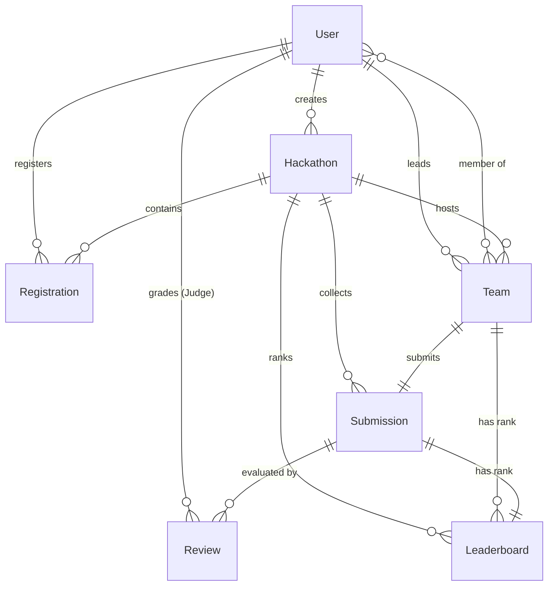

# Database Schema & Relationships

This document outlines the Mongoose database schemas, validations, indexing configurations, and collection relationships.

---

## 📊 Entity-Relationship (ER) Diagram

---

## 📁 Collection Schemas

### 1. Users (`users`)
Stores platform accounts details and block credentials.
* **Fields**:
  - `name` (String, Required, Trimmed)
  - `email` (String, Required, Unique, Trimmed, Lowercase)
  - `password` (String, Required, Excluded by default in queries)
  - `role` (String, Required, Enum: `['Admin', 'Organizer', 'Participant', 'Judge']`)
  - `profileImage` (String, Default: `""`)
  - `isBlocked` (Boolean, Default: `false`)
* **Indexes**:
  - `{ email: 1 }` (Unique)

### 2. Hackathons (`hackathons`)
Stores the created hackathon events.
* **Fields**:
  - `title` (String, Required, Trimmed)
  - `description` (String, Default: `""`)
  - `theme` (String, Required, Trimmed)
  - `mode` (String, Required, Enum: `['Online', 'Offline']`)
  - `venue` (String, Default: `""` - Required if Offline)
  - `startDate` (Date, Required)
  - `endDate` (Date, Required)
  - `registrationDeadline` (Date, Required)
  - `bannerImage` (String, Default: `""`)
  - `prizePool` (Number, Default: `0`, Min: `0`)
  - `maxTeamSize` (Number, Required, Min: `1`)
  - `rules` (String, Default: `""`)
  - `judgingCriteria` (String, Default: `""`)
  - `status` (String, Default: `'Upcoming'`, Enum: `['Upcoming', 'Registration Open', 'Registration Closed', 'Ongoing', 'Completed']`)
  - `createdBy` (ObjectId ref `'User'`, Required)
* **Validations**:
  - Pre-validate hook: `registrationDeadline` must be before `startDate`, and `endDate` must be after `startDate`.

### 3. Registrations (`registrations`)
Stores applicant requests and approvals to join hackathons.
* **Fields**:
  - `participant` (ObjectId ref `'User'`, Required)
  - `hackathon` (ObjectId ref `'Hackathon'`, Required)
  - `status` (String, Default: `'Pending'`, Enum: `['Pending', 'Approved', 'Rejected', 'Cancelled']`)
  - `registeredAt` (Date, Default: `Date.now`)
  - `approvedAt` (Date)
  - `remarks` (String, Default: `""`)
* **Indexes**:
  - `{ participant: 1, hackathon: 1 }` (Unique compound index)

### 4. Teams (`teams`)
Groups participant records for solution assembly.
* **Fields**:
  - `teamName` (String, Required, Trimmed)
  - `hackathon` (ObjectId ref `'Hackathon'`, Required)
  - `leader` (ObjectId ref `'User'`, Required)
  - `members` (Array of ObjectIds ref `'User'`)
  - `maxMembers` (Number, Required, Min: `1`)
  - `inviteCode` (String, Unique)
  - `status` (String, Default: `'Active'`, Enum: `['Active', 'Locked', 'Disbanded']`)
* **Validations**:
  - Unique compound index on `{ hackathon: 1, teamName: 1 }` prevents duplicate team names in the same campaign.
  - Pre-validate hook: Generates a random alphanumeric code `JOIN-XXXXXX`.

### 5. Submissions (`submissions`)
Stores the project solution portals uploaded by teams.
* **Fields**:
  - `team` (ObjectId ref `'Team'`, Required, Unique)
  - `hackathon` (ObjectId ref `'Hackathon'`, Required)
  - `projectName` (String, Required, Trimmed)
  - `problemStatement` (String, Required, Trimmed)
  - `solution` (String, Required, Trimmed)
  - `description` (String, Default: `""`)
  - `githubRepository` (String, Required, Trimmed)
  - `liveDemo` (String, Default: `""`)
  - `techStack` (Array of Strings)
  - `screenshots` (Array of Strings)
  - `presentationPDF` (String, Default: `""`)
  - `demoVideo` (String, Default: `""`)
  - `status` (String, Default: `'Pending'`, Enum: `['Pending', 'Under Review', 'Approved', 'Rejected']`)
  - `submittedBy` (ObjectId ref `'User'`, Required)
  - `submittedAt` (Date, Default: `Date.now`)

### 6. Reviews (`reviews`)
Stores scorecard evaluations written by judges.
* **Fields**:
  - `submission` (ObjectId ref `'Submission'`, Required)
  - `hackathon` (ObjectId ref `'Hackathon'`, Required)
  - `judge` (ObjectId ref `'User'`, Required)
  - `innovation` (Number, Required, Range: `0-10`)
  - `technicalComplexity` (Number, Required, Range: `0-10`)
  - `userInterface` (Number, Required, Range: `0-10`)
  - `functionality` (Number, Required, Range: `0-10`)
  - `scalability` (Number, Required, Range: `0-10`)
  - `documentation` (Number, Required, Range: `0-10`)
  - `presentation` (Number, Required, Range: `0-10`)
  - `totalScore` (Number, Required - Auto-Calculated sum)
  - `feedback` (String, Required, Trimmed)
  - `status` (String, Default: `'Pending'`, Enum: `['Pending', 'Completed']`)
* **Validations**:
  - Compound unique index `{ judge: 1, submission: 1 }` prevents judges from submitting multiple reviews for the same prototype.
  - Pre-validate hook: Automatically sums the 7 score categories to populate `totalScore`.

### 7. Leaderboards (`leaderboards`)
Stores the generated ranks of teams for completed hackathons.
* **Fields**:
  - `hackathon` (ObjectId ref `'Hackathon'`, Required)
  - `team` (ObjectId ref `'Team'`, Required)
  - `submission` (ObjectId ref `'Submission'`, Required)
  - `averageScore` (Number, Required)
  - `rank` (Number, Required)
  - `position` (String, Default: `""` - e.g. `'1st Place'`)
  - `isWinner` (Boolean, Default: `false`)
  - `published` (Boolean, Default: `false`)
