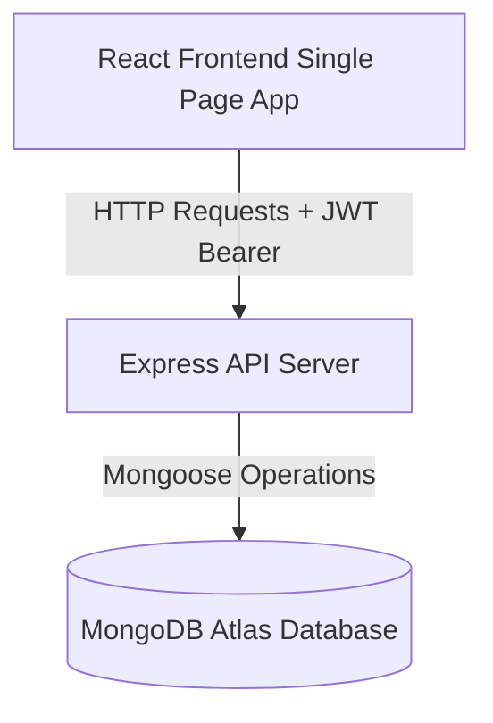

# Project Report: Hackathon Management System

---

## 1. Introduction
The **Hackathon Management System** is a full-stack web application designed to orchestrate and manage hackathons. Built using the MERN stack (MongoDB, Express, React, Node.js), it provides custom, role-based workspaces for Admins, Organizers, Participants, and Judges.

---

## 2. Problem Statement
Organizing hackathons typically involves using fragmented tools for registrations (Google Forms), team matching (Discord/Slack), project uploads (GitHub/Google Drive), and scoring (spreadsheets). This approach results in significant overhead, score calculations errors, delay in leaderboard announcements, and bad user experiences.

---

## 3. Objectives
* **Consolidation**: Combine registration approval, team matching, code uploads, grading, and leaderboard calculation in one platform.
* **Role Separation**: Define workspaces for admins, organizers, contestants, and judges.
* **Security & Fair Play**: Implement validation boundaries preventing unauthorized score manipulation or team size overrides.
* **UX Polish**: Introduce search bars, query selectors, loaders, error alerts, and fully responsive layouts.

---

## 4. System Architecture
The application uses a client-server architecture model:

* **Vite React SPA**: Displays role-based dashboards, handles form validations, and calls endpoints.
* **Express API Server**: Checks tokens, enforces user role validation, processes file uploads, and calculates leaderboard scores.
* **MongoDB Atlas Database**: Stores users, registrations, teams, solutions, and reviews.

---

## 5. Security & Validation Audit
* **Password Hashing**: Done using `bcrypt` (10 rounds) before saving user profiles.
* **JWT Authentications**:
  - Tokens are signed with a server-side `JWT_SECRET`.
  - Sent to client via Authorization header or HTTP-only cookies.
  - Verified on every protected route by the `protect` middleware.
* **Role Authorizations**:
  - Custom `authorize(...allowedRoles)` middleware checks the role of the logged-in user.
  - Endpoints are protected so, for example, only Judges can submit reviews, only Participants can join teams, and only Organizers can generate leaderboards.
* **Duplication Protections**:
  - Unique indexes prevent duplicate email sign-ups, duplicate team names in a hackathon, and duplicate registrations.
  - Submissions are limited to one per team.
  - Judges are prevented from evaluating the same team twice.

---

## 6. Performance Optimization
* **Standardized Paginations**:
  - Large query sets (Hackathons, Users, Submissions, Teams) are paged using `skip` and `limit` in Mongoose queries.
  - Reduces load times and payload sizes.
* **Centralized API Client**:
  - Set up an axios wrapper `api.js` that automatically attaches the auth token and handles unauthorized responses.
* **Component Loading Skeletons**:
  - Implemented loading states and cards to prevent layout shifts.

---

## 7. Challenges & Solutions

### Challenge 1: Centralizing API Coordinates
* **Problem**: Frontend components had hardcoded backend URLs pointing to port `5099`, while the server ran on port `5001`.
* **Solution**: Standardized the backend environment port to `5099` and introduced a centralized Axios wrapper (`api.js`) to set a baseline URL, avoiding repeating URLs in Axios requests.

### Challenge 2: Real-time UI State Synchronization
* **Problem**: Dynamic updates (such as login states or role changes) were not immediately reflected in components like the Navbar without page reloads.
* **Solution**: Implemented a global listener on the `storage` event, triggerable by custom storage dispatches, prompting immediate UI re-evaluations.

---

## 8. Future Enhancements
* **Peer Reviews**: Allow participants to review other teams' projects.
* **Real-time Team Chat**: Integrate Socket.io to allow team members to communicate inside the workspace.
* **Automated Code Auditing**: Integrate GitHub Webhooks to verify repository commits automatically.

---

## 9. Conclusion
The MERN Hackathon Management System provides a secure, fast, and feature-rich workspace that consolidates the entire hackathon lifecycle. With its clean layouts, validations, and query managers, it is fully ready for production deployment.
